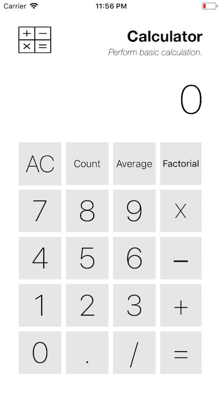

# Simple Calculator iOS App

This is an INFO 449 iOS Development assignment that involves creating a fully-functional basic calculator app.

## Functionalities

- Addition
- Subtraction
- Multiplication
- Division
- Counting number of inputs made
- Average number
- Factorial of a number

### Examples

#### Add

To add a number, perform `number`, follow by `+`, then another `number`.

#### Count

To count a set of numbers, perform `number` and press `Count`, repeat the process (`number` then `Count`) until ready to press `=`.

#### Average

To find the average of a set of numbers, perform `number` and press `Average`, repeat the process (`number` then `Average`) until ready to press `=`.

#### Factorial

Press a `number` then press `Fact`, and followed by the `=` button.

---

## Screenshot

